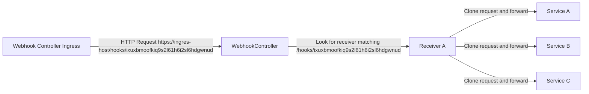

# webhook-controller - Proxy for duplicating incoming webhooks to multiple targets

[](https://github.com/DoodleScheduling/webhook-controller/releases)
[](https://github.com/doodlescheduling/webhook-controller/actions/workflows/release.yaml)
[](https://goreportcard.com/report/github.com/DoodleScheduling/webhook-controller)
[](https://api.securityscorecards.dev/projects/github.com/DoodleScheduling/webhook-controller)
[](https://coveralls.io/github/DoodleScheduling/webhook-controller?branch=master)
[](https://github.com/DoodleScheduling/webhook-controller/blob/master/LICENSE)

This HTTP proxy duplicates incoming requests and sends concurrently to multiple targets.
The response is asynchronous by default `HTTP 202 Accepted` if at least one matching target was found.
However alternatively synchronous processing is also supported (see bellow).

## Why?
This proxy is especially useful for handling incoming webhooks which need to be distributed to multiple targets.
However it can be used for any other use case where a request needs to be duplicated.

## Setup

The proxy should not be exposed directly to the public. Rather should traffic be routed via an ingress controller
to the webhook-controller.

## Example Receiver

In this example an incoming http request will be cloned and forwarded to `podinfo:http` and `podinfo-v2:9091`.
The response will be `HTTP 202 Accepted` no matter what these targets will respond.

```yaml
apiVersion: webhook.infra.doodle.com/v1beta1
kind: Receiver
metadata:
  name: webhook-receiver
spec:
  targets:
  - service:
      name: podinfo
      port:
        name: http
  - service:
      name: podinfo-v2
      port:
        number: 9091
```

Once the controller reconciled the receiver it will be registered in the proxy which by default processes incoming requests at port `8080`.
Each receiver will receive its own dedicated http path to which webhooks can be send to. See `.status.webhookPath`.
Usually the webhook-controller is exposed via an ingress. In this case the the webhooks must sent to `http://ingress-host/hooks/ixuxbmoofkiq9s2l61h6i2sl6hdgwnud`.

**Note**: The webhookPath will not change anymore once it was set.

```yaml
apiVersion: webhook.infra.doodle.com/v1beta1
kind: Receiver
metadata:
  name: webhook-receiver
spec:
  type: Async
  targets:
  - service:
      name: podinfo
      port:
        name: http
  - service:
      name: podinfo-v2
      port:
        name: http
  spec:
    responseType: Async
    targets:
    - service:
        name: podinfo
        port:
          name: http
  status:
    conditions:
    - lastTransitionTime: "2025-12-15T07:41:02Z"
      message: receiver successfully registered
      reason: ServiceBackendReady
      status: "True"
      type: Ready
    webhookPath: /hooks/ixuxbmoofkiq9s2l61h6i2sl6hdgwnud
```

## Request flow


## More configurations

### Response type
Besides async responses a receiver can also be synchronous. Meaning it will await the upstream responses.
In this case `AwaitAllPreferSuccessful` will wait for both upstream targets and will send downstream the first successful http response from either targets once all targets
were processed.

```yaml
apiVersion: webhook.infra.doodle.com/v1beta1
kind: Receiver
metadata:
  name: webhook-receiver
spec:
  type: AwaitAllPreferSuccessful
  targets:
  - service:
      name: podinfo
      port:
        name: http
  - service:
      name: podinfo-v2
      port:
        number: 9091
```

The following types are supported:
* `Async` - The default, does not await reponses from upstream and immeadiately acknowledges incoming requests with a `HTTP 202 Accepted`.
* `AwaitAllPreferSuccessful` - Await all upstream responses and send back the first successful repsonse (>= 200 && < 400). If all of them are not successful it will send back the last failed response.
* `AwaitAllPreferFailed` - Await all upstream responses and send back the first failed repsonse (< 200 && >= 400). If all of them are successful it will send back the last sucessful response.
* `AwaitAllReport` - Await all upstream responses and send back a json object containing all target responses including status code, body and headers. The status code of this type will always be `HTTP 200 OK`.

### Path rewrite

By default http requests are sent upstream to `/`. The target path can be rewritten like:

```yaml
apiVersion: webhook.infra.doodle.com/v1beta1
kind: Receiver
metadata:
  name: webhook-receiver
spec:
  timeout: 3s
  targets:
  - path: /new/path
    service:
      name: podinfo
      port:
        name: http
  - path: /another/path
    service:
      name: podinfo-v2
      port:
        number: 9091
```

### Timeout

The default timeout for upstream requests is `10s`, this can be changed however:

```yaml
apiVersion: webhook.infra.doodle.com/v1beta1
kind: Receiver
metadata:
  name: webhook-receiver
spec:
  timeout: 3s
  targets:
  - service:
      name: podinfo
      port:
        name: http
  - service:
      name: podinfo-v2
      port:
        number: 9091
```

### Cross namespace targets

By default target services are only selected in the same namespace the receiver lives. A receiver can discover services across namespaces by defining a namespace selector on the target. In this case a service called `podinfo` will be disovered in any namespace on the cluster.

```yaml
apiVersion: webhook.infra.doodle.com/v1beta1
kind: Receiver
metadata:
  name: webhook-receiver
spec:
  type: AwaitAllPreferSuccessful
  targets:
  - service:
      name: podinfo
      port:
        name: http
    namespaceSelector: {}

```

### OpenTelemetry distributed tracing
The controller supports http traces for the requests. See the `--otel-*` controller flags bellow. 

## Installation

### Helm chart

Please see [chart/webhook-controller](https://github.com/DoodleScheduling/webhook-controller) for the helm chart docs.

### Manifests/kustomize

Alternatively you may get the bundled manifests in each release to deploy it using kustomize or use them directly.

## Configure the controller

The controller can be configured using cmd args:
```
--concurrent int                            The number of concurrent Pod reconciles. (default 4)
--enable-leader-election                    Enable leader election for controller manager. Enabling this will ensure there is only one active controller manager.
--graceful-shutdown-timeout duration        The duration given to the reconciler to finish before forcibly stopping. (default 10m0s)
--health-addr string                        The address the health endpoint binds to. (default ":9557")
--http-addr string                          The address of http server binding to. (default ":8080")
--insecure-kubeconfig-exec                  Allow use of the user.exec section in kubeconfigs provided for remote apply.
--insecure-kubeconfig-tls                   Allow that kubeconfigs provided for remote apply can disable TLS verification.
--kube-api-burst int                        The maximum burst queries-per-second of requests sent to the Kubernetes API. (default 300)
--kube-api-qps float32                      The maximum queries-per-second of requests sent to the Kubernetes API. (default 50)
--leader-election-lease-duration duration   Interval at which non-leader candidates will wait to force acquire leadership (duration string). (default 35s)
--leader-election-release-on-cancel         Defines if the leader should step down voluntarily on controller manager shutdown. (default true)
--leader-election-renew-deadline duration   Duration that the leading controller manager will retry refreshing leadership before giving up (duration string). (default 30s)
--leader-election-retry-period duration     Duration the LeaderElector clients should wait between tries of actions (duration string). (default 5s)
--log-encoding string                       Log encoding format. Can be 'json' or 'console'. (default "json")
--log-level string                          Log verbosity level. Can be one of 'trace', 'debug', 'info', 'error'. (default "info")
--max-retry-delay duration                  The maximum amount of time for which an object being reconciled will have to wait before a retry. (default 15m0s)
--metrics-addr string                       The address the metric endpoint binds to. (default ":9556")
--min-retry-delay duration                  The minimum amount of time for which an object being reconciled will have to wait before a retry. (default 750ms)
--otel-endpoint string                      Opentelemetry gRPC endpoint (without protocol)
--otel-insecure                             Opentelemetry gRPC disable tls
--otel-service-name string                  Opentelemetry service name (default "webhook-controller")
--otel-tls-client-cert-path string          Opentelemetry gRPC mTLS client cert path
--otel-tls-client-key-path string           Opentelemetry gRPC mTLS client key path
--otel-tls-root-ca-path string              Opentelemetry gRPC mTLS root CA path
--watch-all-namespaces                      Watch for resources in all namespaces, if set to false it will only watch the runtime namespace. (default true)
--watch-label-selector string               Watch for resources with matching labels e.g. 'sharding.fluxcd.io/shard=shard1'.
```
